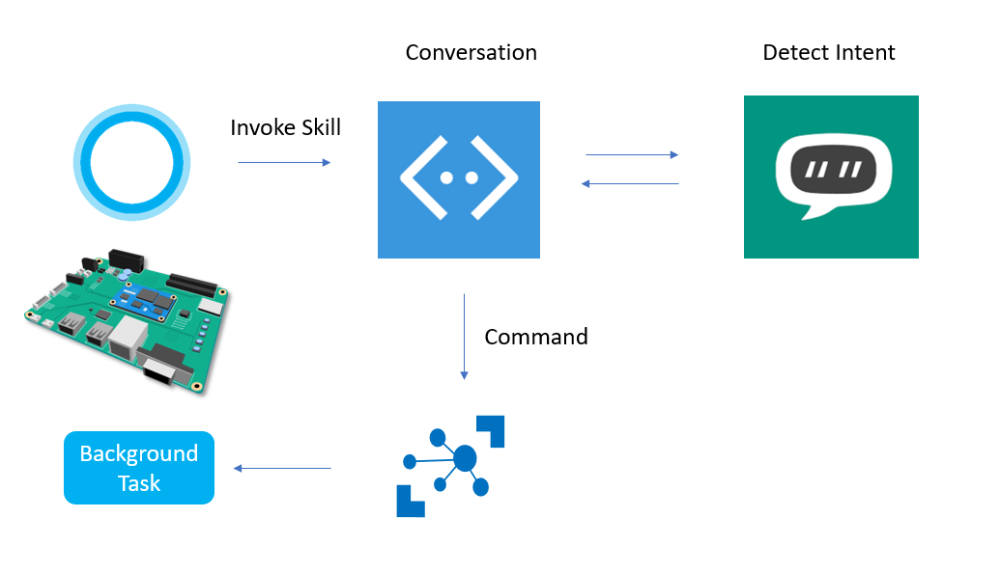
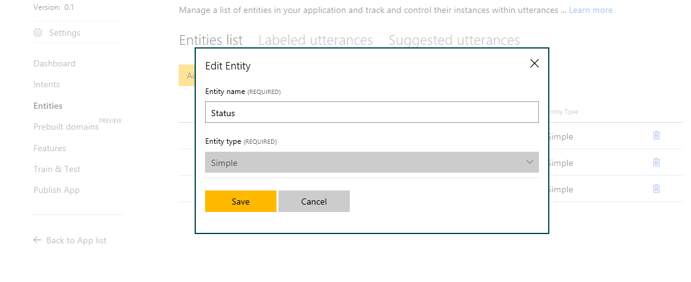
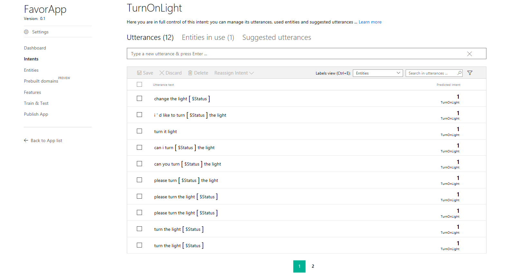
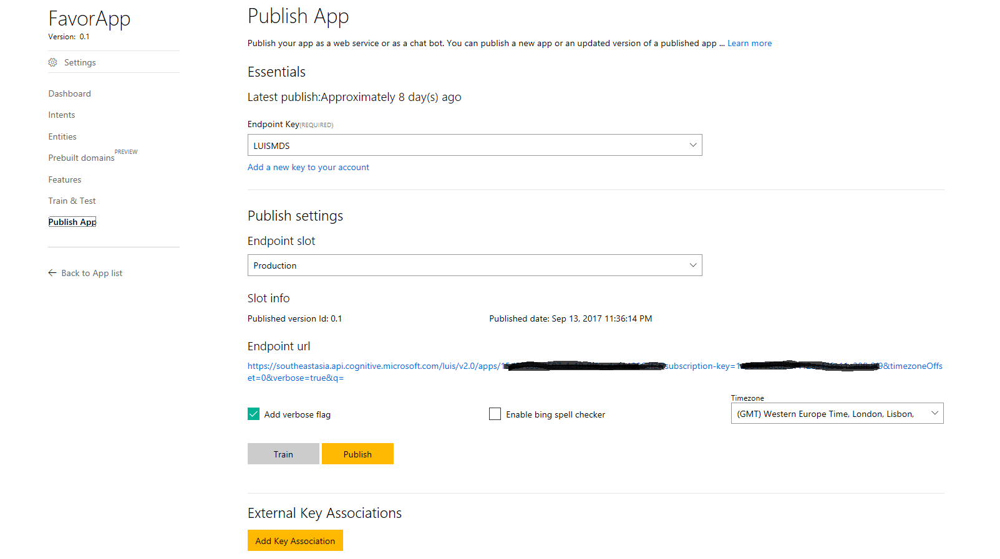
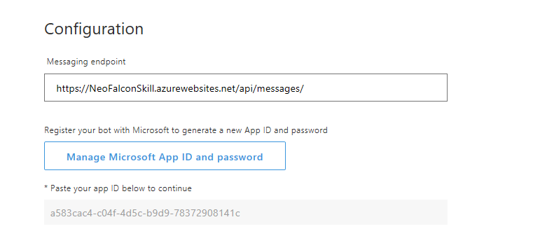
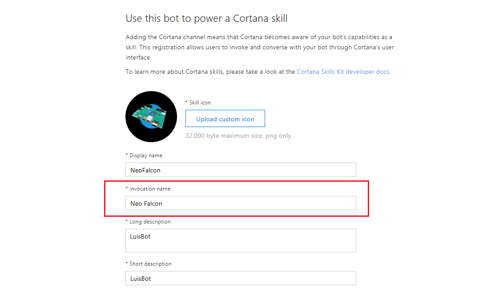

<<<<<<< HEAD
=======

>>>>>>> a3a023cbaacd5f8daab719775e92af34a8a9c43d
# NeoFalcon Cortana Skills Kit
NeoFalcon Background App, Bot Framework, Cortana Skills kit, LUIS

Windows 10 IoT Core Cortana can implement its Skills Kit 
Since Windows 10 Creator Update, Cortana is available in Windows 10 IoT Core and Cortana Skills kit too!
The Hancom MDS Inc. (MDS Technology)'s Windows 10 IoT Core device (NeoFalcon) can talk to MS Bot Framework and LUIS. 
LUIS can detect the User Voice intent then the Bot framework send the corresponding command back to NeoFalcon.   

  
<<<<<<< HEAD
<<<<<<< HEAD

##LUIS Setup

###LUIS Intent Setup 
You can set the LUIS environment here (https://www.luis.ai)

###Set your entity first. In this sceniario, my LUIS detects the light status(ON/OFF). 
  

###You can configure your Utterences in the Intents tab. The Entity previosly set is replaced with candidate words(ON/OFF) 
 

###Please note the App ID, your Subscription ID in the Endpoint url. 
 

##Bot Setup
Please make sure that you need to input your Azure webapp address where you deployed your NeoFalconSkill project.    
 

##Cortana Skills Kit invoke name
=======

## LUIS Setup

### LUIS Intent Setup
You can set the LUIS environment here (https://www.luis.ai)

### Set your entity first. In this sceniario, my LUIS detects the light status(ON/OFF).
  

### You can configure your Utterences in the Intents tab. The Entity previosly set is replaced with candidate words(ON/OFF) 
 

### Please note the App ID, your Subscription ID in the Endpoint url.
 

## Bot Setup
Please make sure that you need to input your Azure webapp address where you deployed your NeoFalconSkill project.    
 

## Cortana Skills Kit invoke name
>>>>>>> a3a023cbaacd5f8daab719775e92af34a8a9c43d
You wanna talk your own Cortana skills like "Ask NeoFalcon!". 
In order to set the skills invoke name, you need to configure the name in the Bot channel edit page. 

<<<<<<< HEAD

=======
>>>>>>> 72460b743e7cccd83ee46bc2132acd66217622de
=======
>>>>>>> a3a023cbaacd5f8daab719775e92af34a8a9c43d
