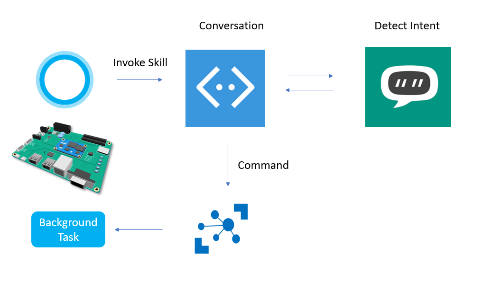

# NeoFalconSkillsKit
NeoFalcon Background App, Bot Framework, Cortana Skills kit, LUIS

##Windows 10 IoT Core Cortana can implement its Skills Kit 
Since Windows 10 Creator Update, Cortana is available in Windows 10 IoT Core and Cortana Skills kit too!
The Hancom MDS Inc. (MDS Technology)'s Windows 10 IoT Core device (NeoFalcon) can talk to MS Bot Framework and LUIS. 
LUIS can detect the User Voice intent then the Bot framework send the corresponding command back to NeoFalcon.   

  
